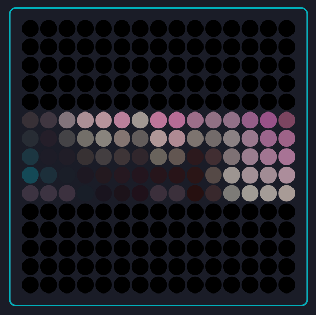
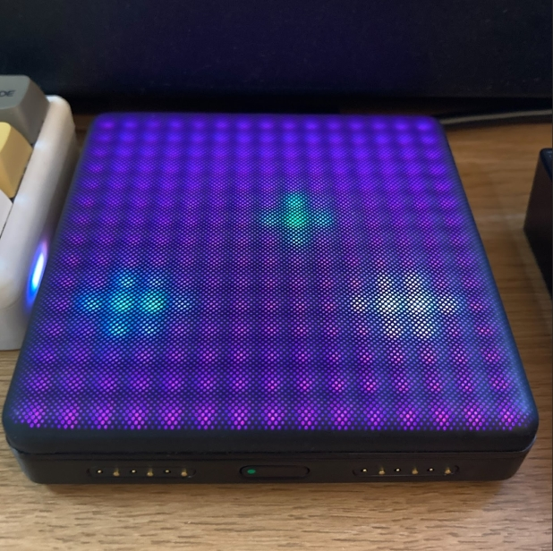

# 3XYZ for Roli Lightpad
 Send XYZ from up to 3 Roli Lightpad touch points; map to your DAW on the fly without Dashboard!

With this you can assign MIDI CC numbers to the X, Y and Z axes of up to 3 touch points, then easily map them in your DAW using the Mode button as a shift-key or by striking the top-left corner of the pad to toggle mapping mode. In mapping mode, touching the relevant square on the 3x3 grid will send continuous MIDI messages with that CC number, so you can easily map/learn in your DAW without having to filter MIDI messages from the other axes. With the factory XYZ pad app, you have to keep alt-tabbing back to the Dashboard app to adjust the 'Send' options per axis and...that's horrible.

I could have used Modes for this, but Roli Dashboard appears to have lost the tickbox for loading Modes to the device. 

There's not a great deal of info about Littlefoot out there, but between the SDK docs and various examples I was able to knock this together pretty quickly. Nice little language! Put 3XYZ.littlefoot in Documents\ROLI\LittleFoot (wherever that is on your machine) and Dashboard should see it, then load it into your Lightpad when you click on it. 

To use: holding down the Mode button on the side of the Lightpad will display the 3x3 mapping grid. Left to right, it goes X Y Z for each touch point. When the mapping grid is visible, touching a square will display the currently assigned CC value (set up in Dashboard) and it'll also send a continuous stream of CC messages which your DAW will hopefully receive. Crucially, it'll send messages for ONLY that CC, so you can isolate each axis and map only what you want in your DAW. When you release the Mode button you're back in normal touch control mode.

If your Mode button is inaccessible because your Lightpad is connected to other blocks, or just pushed up against another MIDI controller like mine, you can instead toggle mapping mode on and off by tapping hard on the top-left corner of the Lightpad. I prefer this. You can set the velocity sensitivity threshold in Dashboard; mine's really low, because in normal touch-control use I only venture to the top left of the pad when I'm already touching and moving; I never strike up there in normal use. YMMV. Toggling the mapping mode like this is also a bit easier than having to adopt a weird claw hold in order to keep the Mode button pressed while messing around in the DAW...

Thoughts/To-do:

* I'm not sure how useful two or even three touch points are going to be for me. It's rare that I want Z-pressure on the same control as X/Y, but also a pain to have to add a second touch in order to separate it out - I'll alwways have to remember to put an X/Y finger down first, which might result in unwanted MIDI messages. Setting up a small zone in the bottom-right corner might be the answer: exclude X/Y touch detection from there, and allow it to be mapped purely for Z-presure. I'd operate this with a thumb while using one or more fingers on X/Y. 
* This is a cool device - especially the M, and especially if you can get one cheap. If you don't need wireless, see if you can find one with a dead battery and just use it with USB. I really got this _just_ as an X/Y pad controller because it's surprisingly hard to find a good one that isn't either part of a huge workstation keyboard that you don't otherwise want, or that isn't part of a crappy cheap USB controller that you don't otherwise want, or that isn't just part of a cool bit of kit that sadly doesn't send MIDI (Korg Mini-KP and Mini Kaoss Pad 2S). So all functionality beyond X/Y is a bonus - even the z-axis - and I won't feel like I'm failing to make the most of all the possibilities.