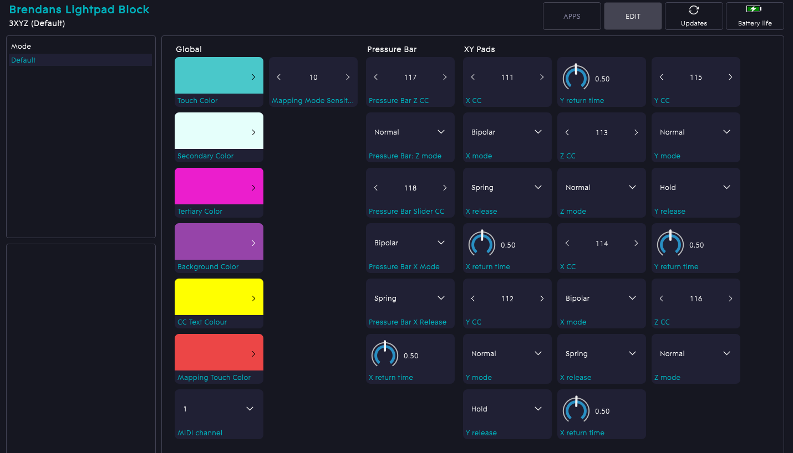

# 3XYZ for Roli Lightpad
 Send XYZ from 2 Roli Lightpad touch pads and XZ from a pressure/slider bar; map to your DAW on the fly without Dashboard!

With this Littlefoot app for the Roli Lightpad you can assign MIDI CC numbers to the X, Y and Z axes of two separate portrait-orienteted touch pads and to the X and Z axes of a horizontal slider/pressure pad at the bottom of the control surface. This is great for expressive 2-finger control over synths - orchestral VSTs in particular - but with the ability to use an independent area of the controller for Z-axis messages, which are hard to control consistently with a finger that's also moving on the X and Y axes. 

Each area is highly configurable, with 'spring' return vs hold upon touch release; adjustable lerp speed for spring release; and normal, inverted, bipolar or binary MIDI output modes.

 

My favourite thing (the reason I wrote this) is a Mapping Mode page, accessed by striking the top-left corner above a configurable pressure threshold: here you can touch an area of a grid which represents each zone's axes and emit a datastream on _only_ that CC, making it possible to easily map that CC to a function in your DAW. By default, the factory XYZ app that comes with the Lightpad requires you to switch back and forth between your DAW and Roli's Dashboard app to isolate each CC for mapping, which is a huge pain and a massive roadbump in one's workflow.

There's not a great deal of info about Littlefoot out there, but between the SDK docs and various examples I was able to knock this together pretty quickly. Nice little language! 

## Installation 
Put 3XYZ.littlefoot in Documents\ROLI\LittleFoot (wherever that is on your machine) and then ROLI Dashboard should see it, and then clicking on it should immediately upload it to your Lightpad.

## Usage
Hitting the top left corner of the Lightpad will change to Mapping Mode and display a 2 x 4 grid. Left top, second and third correspond with the left-hand XYZ pad's axes; right top, second and third correspond with the right-hand pad's axes. The bottom bar is now split into two sections, where the left section maps the X-axis of the pressure bar so it can be used as a slider, and the right section maps the Z/pressure axis of the bar. Pressing a section will display the currently configured CC number (which can be edited in the ROLI Dashboard) and it'll also emit a constant stream of messages on that CC so you can easily catch it in your DAW and map it to whatever you want. Strike the top-left corner again to return to Control Mode.

## Configuration (ROLI Dashboard)

As well as changing the MIDI channel, the colour scheme and all axes' CC values, you can also adjust whether axes should 'spring' back to some default (0 for normal mode and binary, 127 for inverted, 64 for bipolar), and how long that should take, or whether the value should be held when you release your finger. By default, all Z-axis controls always spring and can't be set to bipolar, since the nature of the hardware is for it to spring back to its initial state and so those options would make no sense.

If you find it's too hard - or too easy - to enter Mapping Mode, you can adjust the sensitivity threshold in ROLI Dashboard.

## Thoughts/To-do:

* My spring lerps aren't quite getting there, if they're returning a bipolar value to 64 from a lower value, and sometimes they can stick on and endlessly transmit CC messages. Need to fix that.
* This is a cool device - especially the M, and especially if you can get one cheap. If you don't need wireless, see if you can find one with a dead battery and just use it with USB. I really got this _just_ as an X/Y pad controller because it's surprisingly hard to find a good one that isn't either part of a huge workstation keyboard that you don't otherwise want, or that isn't part of a crappy cheap USB controller that you don't otherwise want, or that isn't just part of a cool bit of kit that sadly doesn't send MIDI (Korg Mini-KP and Mini Kaoss Pad 2S). So all functionality beyond X/Y is a bonus - even the z-axis - and I won't feel like I'm failing to make the most of all the possibilities.
* I'll put a quick video together when I get a chance.
* I might reintroduce the hardware 'mode' button for its original purpose: to cycle between Modes (presets, basically) that can be set up and saved in ROLI Dashboard.
* I should really add pitchbend as an option for all X and Y axes, and maybe also for Z axes with an up/down-only constraint. It would make a lot of sense for sprung X axes on the pads to be assignable to pitchbend.